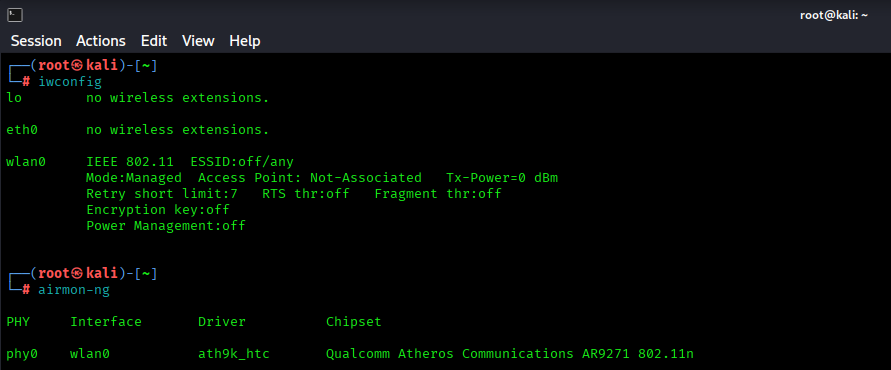
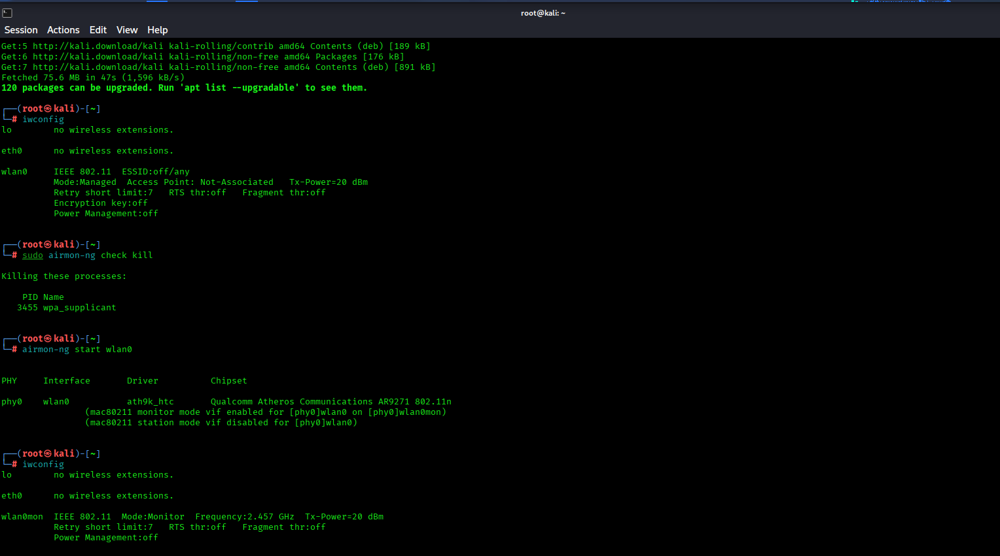
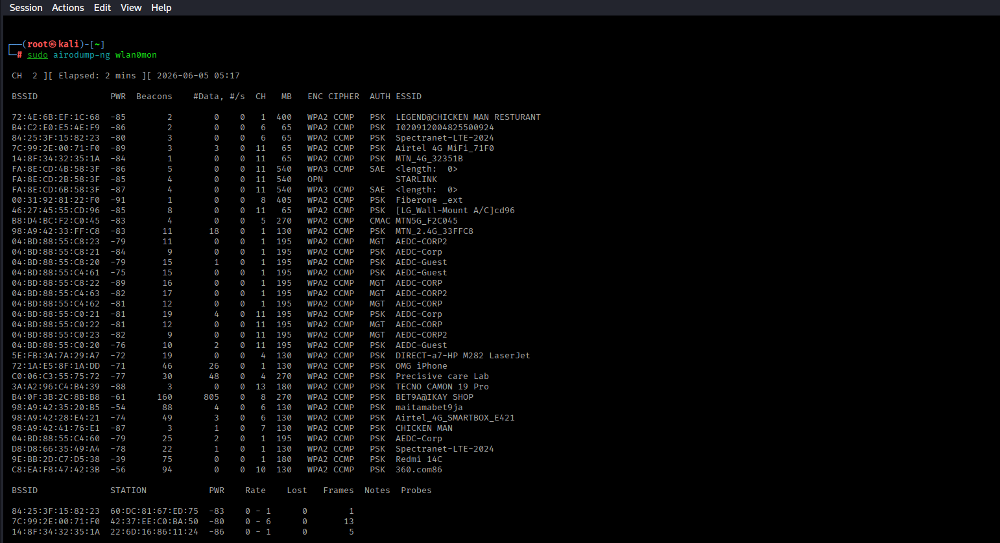
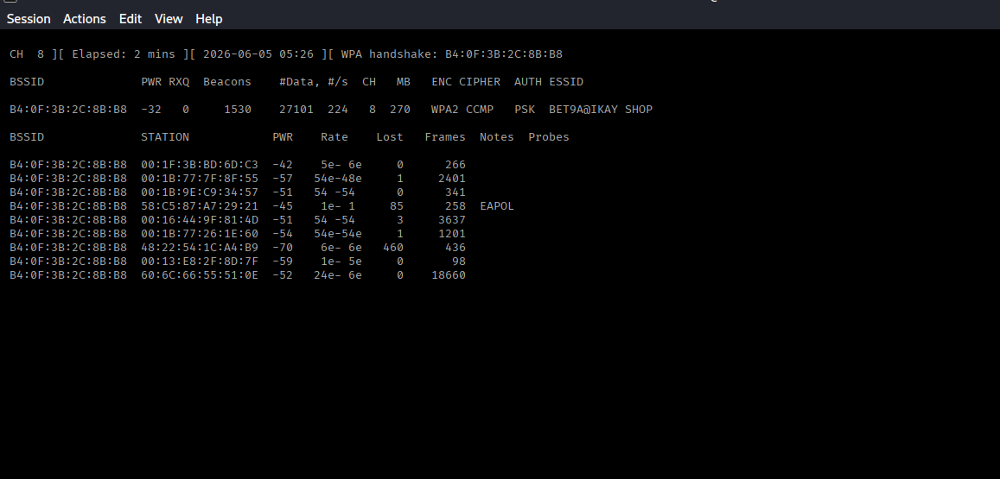
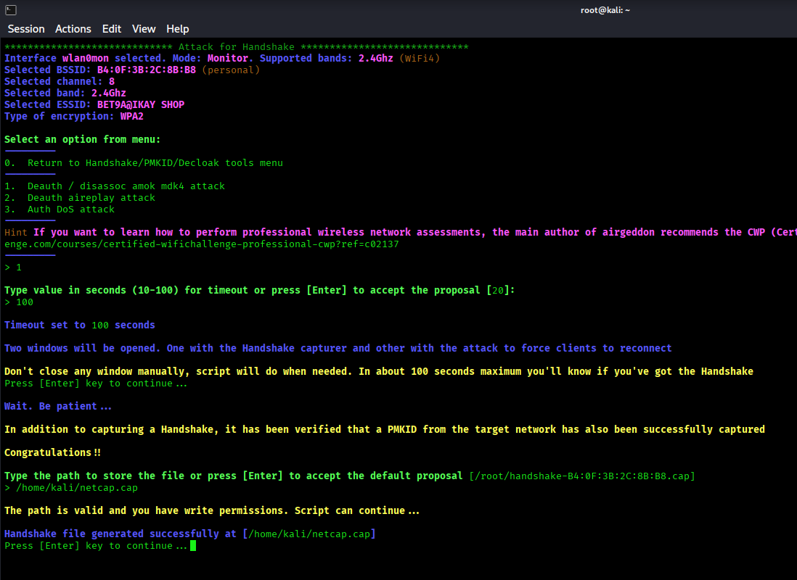
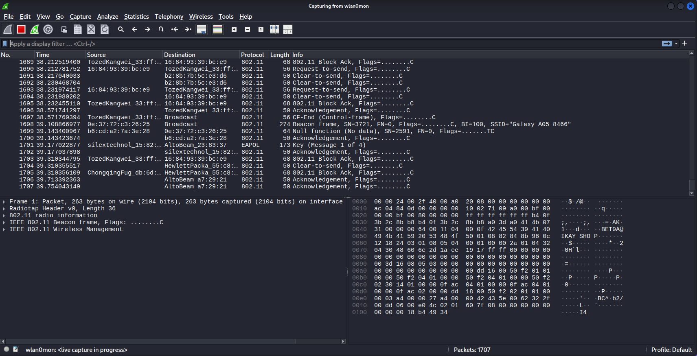

# Enterprise Wireless Infrastructure Security Assessment, Attack Simulation, and Remediation Analysis

## Project Overview

This repository contains a comprehensive wireless security assessment conducted as part of the Ethical Hacking Professional Course.

The project focused on evaluating wireless security weaknesses, attacker methodologies, wireless traffic analysis, MITRE ATT&CK mapping, governance failures, and enterprise wireless redesign recommendations.

The assessment was performed in a controlled and authorized laboratory environment for educational and defensive cybersecurity purposes.

## Project Task

### Enterprise Wireless Network Security Failure Assessment and Security Investigation

The objective of this project was to conduct a full wireless security assessment and remediation analysis covering:

* Wireless reconnaissance
* Wireless attack simulation
* WPA/WPA2/WPA3 security analysis
* Rogue device detection
* Wireless governance failures
* MITRE ATT&CK mapping
* Wireless risk assessment
* Enterprise wireless redesign
* Wireless SOC monitoring
* Executive reporting
* Remediation planning

### Required Deliverables

* Wireless Security Assessment Report
* RF Reconnaissance Report
* Wireless Attack Chain Analysis
* WPA/WPA2/WPA3 Security Analysis
* Rogue Device Detection Report
* Wireless Governance Failure Analysis
* MITRE ATT&CK Mapping
* Wireless Risk Register
* Enterprise Wireless Redesign Architecture
* Wireless SOC Monitoring Plan
* Executive Briefing Report
* 30-60-90 Day Remediation Plan

## Assessment Environment

### Hardware

* Kali Linux Workstation
* Wireless Adapter supporting Monitor Mode
* Authorized Wireless Test Environment

### Tools Used

| Tool                 | Purpose                                 |
| -------------------- | --------------------------------------- |
| Airodump-ng          | Wireless Reconnaissance                 |
| Airgeddon            | Wireless Assessment & Attack Simulation |
| Wireshark            | Wireless Traffic Analysis               |
| Kali Linux Utilities | Wireless Interface Management           |

## Key Assessment Activities

### Wireless Reconnaissance

* SSID Discovery
* BSSID Identification
* Channel Analysis
* Signal Strength Analysis
* Encryption Enumeration

### Wireless Security Testing

* Monitor Mode Operations
* WPA2 Handshake Capture Assessment
* Evil Twin Assessment
* Offline Password Attack Assessment

### Traffic Analysis

* Beacon Frame Analysis
* Wireless Management Frames
* Protocol Analysis
* Authentication Traffic Observation

### Enterprise Security Analysis

* Governance Failure Review
* MITRE ATT&CK Mapping
* Wireless Risk Assessment
* Security Architecture Redesign

## MITRE ATT&CK Techniques Mapped

| MITRE ID  | Technique               |
| --------- | ----------------------- |
| T1595     | Active Scanning         |
| T1040     | Network Sniffing        |
| T1557     | Adversary-in-the-Middle |
| T1110.002 | Password Cracking       |
| T1669     | Wi-Fi Networks          |

## Assessment Evidence

### Wireless Adapter Detection

### Monitor Mode Activation

### Wireless Reconnaissance Results

### Target Network Analysis

### Handshake Capture Assessment

### Wireless Traffic Analysis

## Key Findings

* WPA2-PSK authentication was observed.
* Wireless traffic could be monitored using passive reconnaissance techniques.
* Weak passwords may expose networks to offline password attacks.
* Wireless segmentation improvements were required.
* Security monitoring controls could be enhanced through dedicated wireless SOC visibility.
* MITRE ATT&CK techniques aligned with observed wireless attack paths.

## Full Assessment Report

📄 [Download Full Report](./report/NetworkShield_Wireless_Security_Assessment_Report.pdf)

## Disclaimer

All activities, scans, exploitations, and simulations demonstrated in this repository were conducted in a controlled lab environment for educational and ethical purposes only. The target systems used were intentionally vulnerable systems owned or authorized for testing. Unauthorized testing against real-world systems is illegal and unethical.
